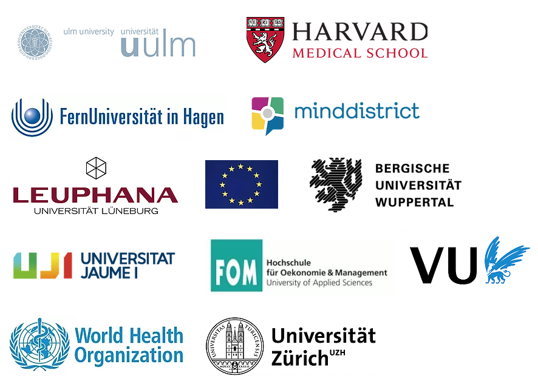

&nbsp;

## Project Description

### Mental Health Promotion in College Students

StudiCare includes various online training courses for the prevention and treatment of mental illness, tailored to the needs of college students. In order to improve existing offers, the StudiCare panel regularly surveys undergraduate students at the Friedrich-Alexander-University and the University of Ulm about their mental well-being from the first semester onwards.

### Background

College is a new stage of life in which students make the transition from adolescence to adulthood. This transition period is characterized by joyful experiences as well as new, stressful situations. These include, for example, looking for one's own apartment, organizing finances and studies, finding new friends, getting used to a new environment, exam stress, etc. In the course of their studies, students are not only confronted with this new situation, but may also experience crises. In combination with possible risk behaviors, such as excessive consumption of alcohol or cannabis, this can lead to exhaustion, psychosomatic complaints, anxiety and depressive disorders.

### StudiCare Panel

The web-based panel survey is conducted in numerous countries worldwide as part of the WHO The World Mental Health Survey Initiative under the coordination of Harvard University among students from the first semester onwards. The aim of the survey is to obtain information on the mental health of students as well as on risk and protective factors for emotional stress during their undergraduate studies. In addition, more information on the willingness and barriers to using psychosocial interventions and counseling services will be collected. With information from the surveys, the need for help and support services will be assessed, existing counseling services will be improved and new online-based interventions tailored to the individual needs of students will be developed.

### StudiCare Online Health Trainings

The online health training courses from StudiCare are low-threshold structured self-help training courses. These trainings can improve the well-being of students and alleviate complaints in a wide variety of areas. They can be used independently of time and place, can be optimally integrated into the individual daily routine and can be conducted anonymously. In the training courses, students manage their complaints independently by working through numerous modules. Modules are based on cognitive-behavioral techniques that are also used in conventional psychotherapy. Essential here are various practical exercises such as relaxation techniques, protocols for self-observation and the integration of small exercises into everyday life ("tiny task"). These help to reduce negative behavior and build up positive behavior. In the course of the project, new trainings are continuously being developed that deal with topics that are relevant for students. The newly developed online health trainings will be examined in randomized clinical studies to evaluate their effectiveness and cost-effectiveness.

[Training Participation](www.studicare.com)

### Evidence-based methods for promoting mental health among students: Series of meta-analytical reviews

In order to derive appropriate measures, a comprehensive assessment of the current evidence base of psychosocial support services is necessary. In a series of meta-analytical reviews, the current knowledge about effective psychological treatment and prevention services including their effectiveness is collected and critically examined. Psychological interventions and their effectiveness are examined with regard to specific disorder areas (e.g. anxiety symptoms, eating disorders, sleep disorders, suicidal tendencies) or intervention methods (e.g. internet-based procedures, "third wave" procedures). Along with clinical effectiveness, special attention is devoted to the influence of interventions on the academic impairment of students.

&nbsp;

## Promotion & Cooperation

BARMER, Bergische Universität Wuppertal, European Union, FernUniversität in Hagen,
FOM University, Harvard Medical School, Leuphana University of Lüneburg, Minddistrict, RWTH Aachen University,
University Jaume I, University of Ulm, University of Zurich, Vrije Universiteit Amsterdam,
World Health Organization

